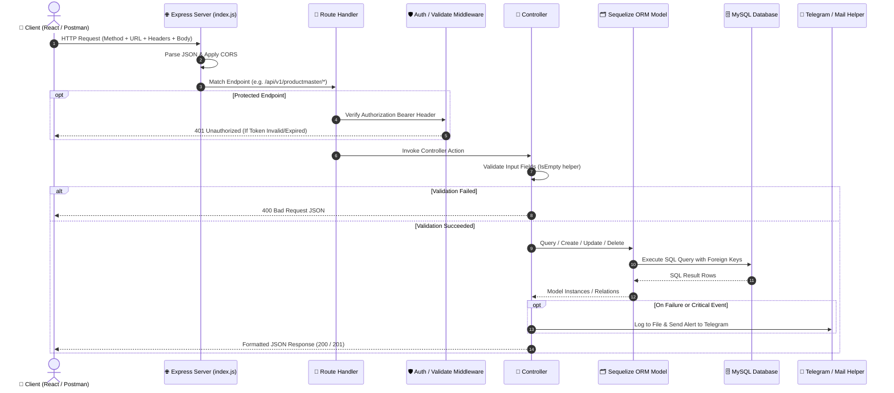
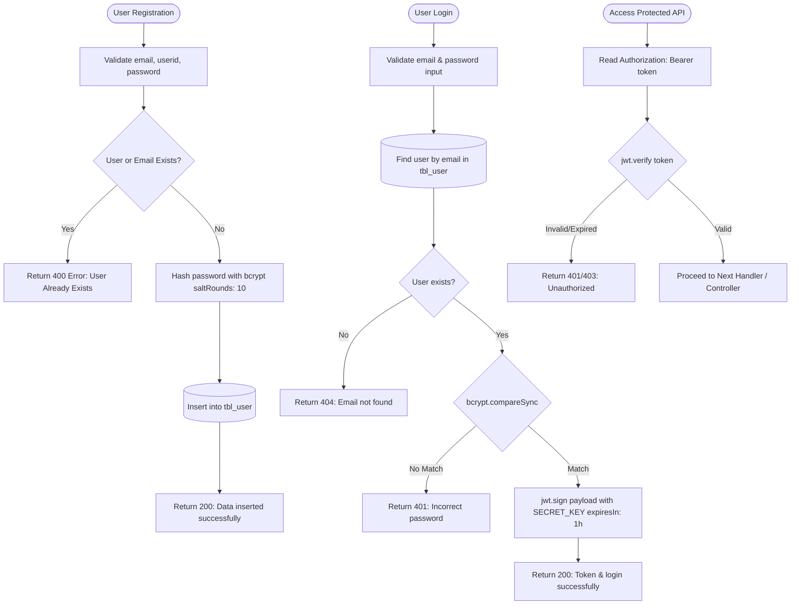
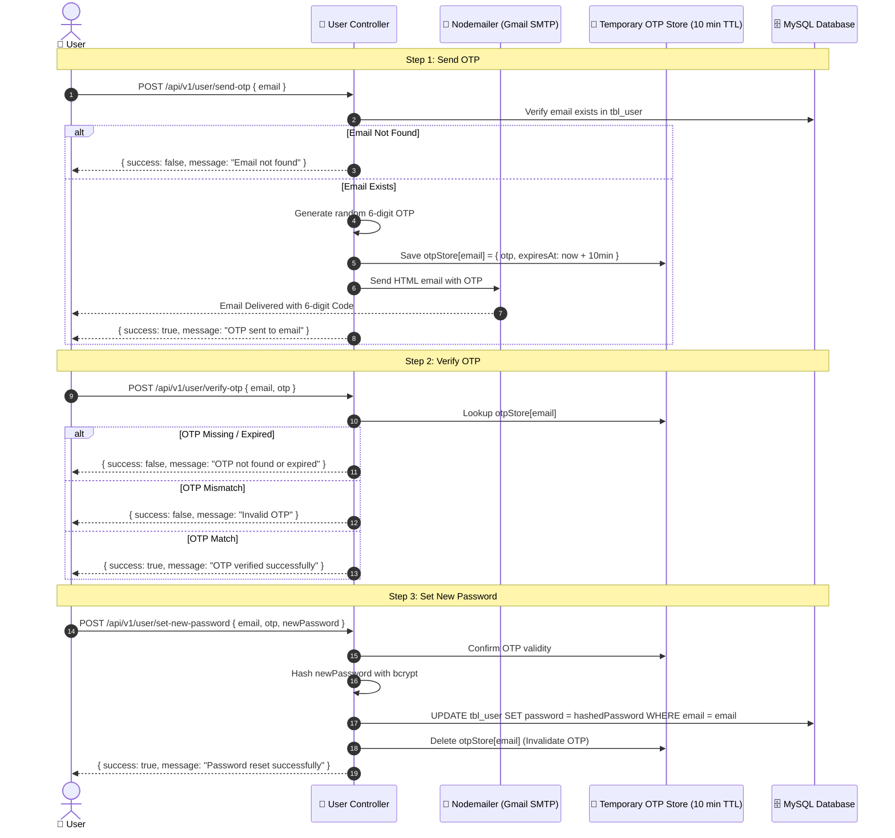
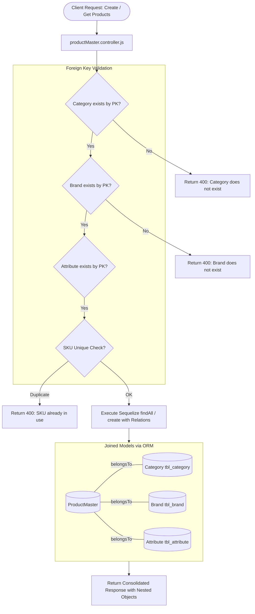
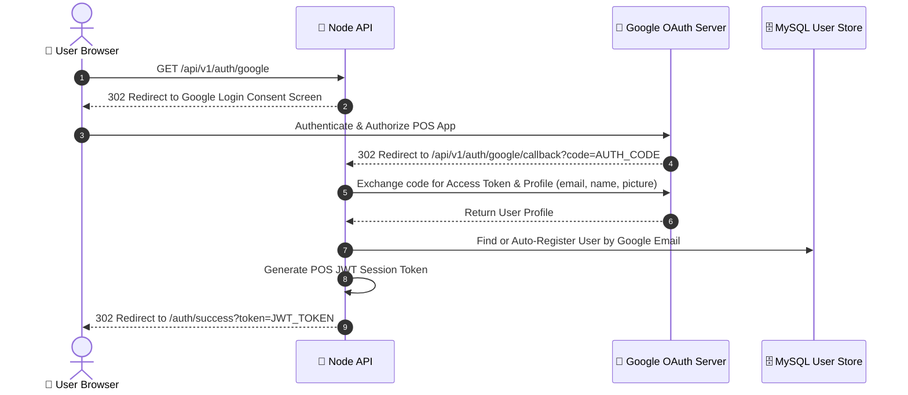
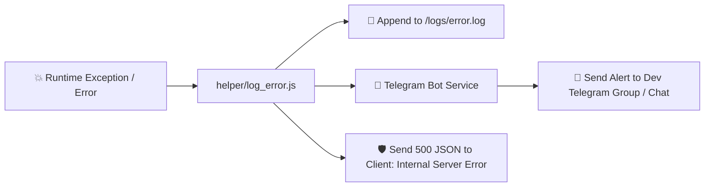
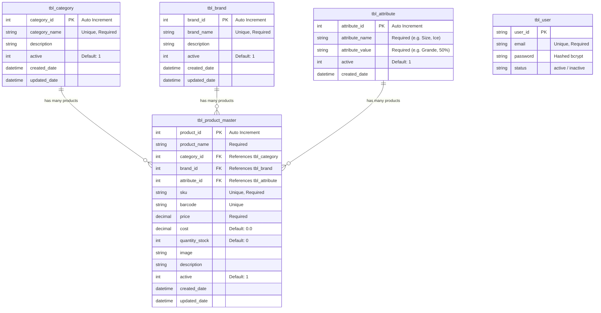

# 🚀 POS Backend API — Architecture & System Flow Documentation

Welcome to the **POS (Point of Sale) Backend API** documentation. This service is built using **Node.js**, **Express.js**, and **Sequelize ORM** with **MySQL**, providing high performance, data integrity, and scalable modular architecture.

---

## 📑 Table of Contents

1. [📐 High-Level System Architecture](#-high-level-system-architecture)
2. [🔄 End-to-End Request & Response Flow](#-end-to-end-request--response-flow)
3. [⚙️ Core Process Flows & Workflows](#️-core-process-flows--workflows)
   - [🔐 1. Authentication & JWT Authorization Flow](#1-authentication--jwt-authorization-flow)
   - [🔑 2. Password Reset & OTP Verification Flow](#2-password-reset--otp-verification-flow)
   - [📦 3. Catalog & Product Master Relational Data Flow](#3-catalog--product-master-relational-data-flow)
   - [🌐 4. Google OAuth 2.0 Single Sign-On Flow](#4-google-oauth-20-single-sign-on-flow)
   - [📢 5. Error Handling & Notification Flow (Telegram & Logs)](#5-error-handling--notification-flow-telegram--logs)
4. [📂 Project Structure & Module Responsibilities](#-project-structure--module-responsibilities)
5. [🗄️ Database Relationships (ERD)](#️-database-relationships-erd)
6. [🛠️ Installation & Getting Started](#️-installation--getting-started)
7. [🧪 API Testing Directory & Quick Links](#-api-testing-directory--quick-links)

---

## 📐 High-Level System Architecture

The backend follows a **Layered MVC / Clean Architecture** pattern ensuring separation of concerns:

```mermaid
graph TD
    Client["📱 Client App (React / Postman / Mobile)"]
    
    subgraph Express_Server["🚀 Express.js Web Server (Port 3000)"]
        direction TB
        Middlewares["⚙️ Global Middleware (CORS, Express JSON, URL-Encoded)"]
        RouterLayer["🚦 Routing Layer (/api/v1/*)"]
        AuthMiddleware["🛡️ Auth & Token Middleware (JWT Validator)"]
        Controllers["🧠 Controllers (Business Logic & Validation)"]
        Services["🔧 Services & Helpers (Mail, Telegram, OAuth, Logger)"]
        SequelizeModels["🗂️ Sequelize Models & Associations"]
    end
    
    subgraph External_Services["☁️ External Services & Database"]
        MySQL[("🗄️ MySQL Database")]
        Gmail["📧 Gmail SMTP (Nodemailer)"]
        Telegram["🤖 Telegram Bot API"]
        GoogleAuth["🔑 Google OAuth 2.0"]
        Stripe["💳 Stripe Payment Gateway"]
        Bakong["🇰🇭 Bakong KHQR Open API"]
    end

    Client -->|HTTP / HTTPS Requests| Middlewares
    Middlewares --> RouterLayer
    RouterLayer --> AuthMiddleware
    AuthMiddleware --> Controllers
    Controllers --> Services
    Controllers --> SequelizeModels
    SequelizeModels -->|ORM Queries / Migrations| MySQL
    Services --> Gmail
    Services --> Telegram
    Services --> GoogleAuth
    Services --> Stripe
    Services --> Bakong
    Controllers -->|JSON Response (200 / 201 / 400 / 500)| Client
```

---

## 🔄 End-to-End Request & Response Flow

Every incoming HTTP request traverses standardized pipeline stages:



---

## ⚙️ Core Process Flows & Workflows

### 1. Authentication & JWT Authorization Flow

Handles user registration, credential hashing with bcrypt, JWT token signing, and protecting private routes.



---

### 2. Password Reset & OTP Verification Flow

A secure 3-step self-service password recovery flow via email OTP codes.



---

### 3. Catalog & Product Master Relational Data Flow

The POS product catalog uses foreign key relations across **Category**, **Brand**, and **Attribute**:



---

### 4. Google OAuth 2.0 Single Sign-On Flow

Allows users to log in seamlessly with Google credentials.



---

### 5. Error Handling & Notification Flow (Telegram & Logs)

Ensures zero silent failures by streaming operational exceptions to developers via Telegram.



---

## 📂 Project Structure & Module Responsibilities

```plaintext
node-api/
├── index.js                      # Application entry point, Express server & DB sync
├── package.json                  # Dependencies, scripts, and project metadata
├── note.md                       # Scratch notes & classroom guidelines
├── logs/                         # File logging directory
│   └── error.log                 # Recorded application errors
│
├── api_tests/                    # 🧪 Feature-based API testing guides & cURL scripts
│   ├── README.md                 # Test suite index & quick cheat-sheet
│   ├── category_api_test.md      # Category endpoints & test cases
│   ├── brand_api_test.md         # Brand endpoints & test cases
│   ├── attribute_api_test.md     # Attribute endpoints & test cases
│   ├── product_master_api_test.md# Product Master endpoints with joins
│   └── user_api_test.md          # User, Auth, and OTP test cases
│
└── src/
    ├── config/                   # Configuration files
    │   ├── config.js             # MySQL raw connection pool
    │   └── sequelizeConfig.js    # Sequelize instance & MySQL credentials
    │
    ├── controller/               # Request handlers & Business logic
    │   ├── auth.controller.js    # Google OAuth controllers
    │   ├── category.controller.js# Category CRUD operations
    │   ├── brand.controller.js   # Brand CRUD operations
    │   ├── attribute.controller.js # Attribute CRUD operations
    │   ├── productMaster.controller.js # Product Master CRUD & joins
    │   └── user.controller.js    # User registration, login, and OTP recovery
    │
    ├── helper/                   # Reusable utilities
    │   ├── log_error.js          # File logger helper
    │   ├── mail_config.js        # Nodemailer SMTP transporter
    │   ├── telegramConfig.js     # Telegram Bot integration
    │   └── validate.js           # IsEmpty validator function
    │
    ├── middleware/               # Express middlewares
    │   └── auth.js               # JWT bearer token verification
    │
    ├── models/                   # Sequelize ORM schema definitions & relationships
    │   ├── category.model.js     # tbl_category definition
    │   ├── brand.model.js        # tbl_brand definition
    │   ├── attribute.model.js    # tbl_attribute definition
    │   ├── productMaster.model.js# tbl_product_master definition
    │   └── index.js              # Model associations & central export
    │
    ├── route/                    # Express route registries
    │   ├── category.route.js     # Category routing (/api/v1/category/*)
    │   ├── brand.route.js        # Brand routing (/api/v1/brand/*)
    │   ├── attribute.route.js    # Attribute routing (/api/v1/attribute/*)
    │   ├── productMaster.route.js# Product Master routing (/api/v1/productmaster/*)
    │   └── user.route.js         # User & Auth routing (/api/v1/user/*)
    │
    └── services/                 # External service handlers
        ├── googleAuth.service.js # Google OAuth token & userinfo fetcher
        └── jwt.service.js        # JWT signer & token decoder
```

---

## 🗄️ Database Relationships (ERD)



---

## 🛠️ Installation & Getting Started

### 1. Prerequisites
- **Node.js**: `v18.x` or higher
- **MySQL Server**: `v8.x` or MariaDB running locally or via Docker

### 2. Configure Environment (`.env`)
Create a `.env` file in the root of `node-api/`:

```ini
# Server Configuration
PORT=3000

# MySQL Database Configuration
DB_HOST=localhost
DB_USER=root
DB_PASSWORD=your_mysql_password
DB_NAME=pos_db
DB_PORT=3306

# JWT Secret Key
SECRET_KEY=your_jwt_super_secret_key_168

# Email SMTP (Gmail App Password)
EMAIL=your_email@gmail.com
APP_PASSWORD=your_gmail_app_password

# Telegram Notification Bot
TELEGRAM_BOT_TOKEN=your_telegram_bot_token
TELEGRAM_CHAT_ID=your_chat_or_group_id

# Google OAuth 2.0 Credentials
GOOGLE_CLIENT_ID=your_google_client_id
GOOGLE_CLIENT_SECRET=your_google_client_secret
GOOGLE_REDIRECT_URI=http://localhost:3000/api/v1/auth/google/callback
```

### 3. Install Dependencies & Start Server
```bash
# Install node packages
npm install

# Start development server with Nodemon
npm run dev

# Or start directly with Node
node index.js
```

> 💡 **Auto-Sync Schema**: On startup, Sequelize will automatically sync and create tables via `sequelize.sync({ alter: true })`.

---

## 🧪 API Testing Directory & Quick Links

All API endpoint requests, cURL scripts, request bodies, and expected status codes are documented by module in the [api_tests/](file:///d:/TRANING/Web%20Frontend%2019/FullStack/POS/node-api/api_tests/README.md) directory:

| Feature Guide | File Link | Description |
|---|---|---|
| 📦 **Category** | [category_api_test.md](file:///d:/TRANING/Web%20Frontend%2019/FullStack/POS/node-api/api_tests/category_api_test.md) | CRUD, search filters, and active status |
| 🏷️ **Brand** | [brand_api_test.md](file:///d:/TRANING/Web%20Frontend%2019/FullStack/POS/node-api/api_tests/brand_api_test.md) | Brand creation, uniqueness check, search & list |
| 🎨 **Attribute** | [attribute_api_test.md](file:///d:/TRANING/Web%20Frontend%2019/FullStack/POS/node-api/api_tests/attribute_api_test.md) | Product attributes, cup sizes, sweetness levels |
| ☕ **Product Master** | [product_master_api_test.md](file:///d:/TRANING/Web%20Frontend%2019/FullStack/POS/node-api/api_tests/product_master_api_test.md) | Product inventory, pricing, SKU, and relational joins |
| 👤 **User & Auth** | [user_api_test.md](file:///d:/TRANING/Web%20Frontend%2019/FullStack/POS/node-api/api_tests/user_api_test.md) | User register, JWT login, and 3-step OTP recovery |
| 📑 **Test Suite Hub** | [README.md](file:///d:/TRANING/Web%20Frontend%2019/FullStack/POS/node-api/api_tests/README.md) | Complete testing workflow sequence and global configurations |
